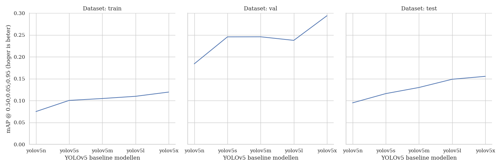
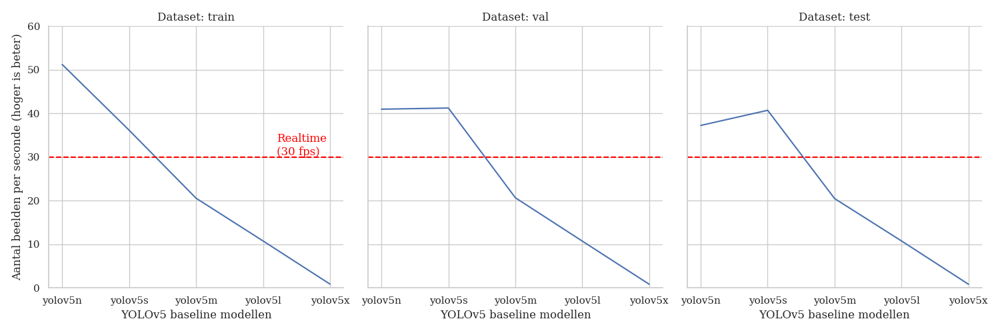

# Implementing YOLOv5 on the RailSem19 dataset

This repository implements multiple YOLOv5 models on the RailSem19 dataset. These implementations are focussed on the `person` and `person-group` classes.

## Installation

- The code is tested on [Python 3.9.9](https://www.python.org/downloads/) and [PyTorch 1.10](https://pytorch.org/get-started/locally/) with CUDA 11.3.
- Install [PyTorch](https://pytorch.org/get-started/locally/) by following the instructions on their website.
- Install [YOLOv5](https://github.com/ultralytics/yolov5) by following the instructions in the README.
- Follow [this](https://stackoverflow.com/a/66800443) StackOverflow answer if you are experiencing the following error: `The paging file is too small for this operation to complete.`

## Baseline results

The following results are achieved on the YOLOv5 models with only the `person` class:




---

The results for the baseline are collected with the following command:

```bash
python ../yolov5/val.py --img-size 1920 --batch-size 1 --data rs19_person.yaml  --task study --single-cls --weights yolov5n.pt yolov5s.pt yolov5m.pt yolov5l.pt
```

If the larger models do not fit on the memory of your graphics card, run the study on your cpu:

```bash
python ../yolov5/val.py --img-size 1920 --batch-size 1 --data rs19_person.yaml  --task study --single-cls --weights yolov5x.pt --device cpu
```

The following column headers are used in the generated text files:
| Precision | Recall | mAP@0,50 | mAP@0,50;0,05;0,95 | _Irrelevant_ | _Irrelevant_ | _Irrelevant_ | Preprocessing time | Total inference time | NMS time |
|-|-|-|-|-|-|-|-|-|-|

## Training

The following command starts the training of your model:

```bash
python ../yolov5/train.py --img-size 640 --batch-size 12 --epochs 100 --data rs19_person.yaml --weights yolov5n.pt
```

## Inference

The following command runs inference on the provided data:

```bash
python ../yolov5/detect.py --source "C:/Users/denbe/Desktop/Cabinerit kilometer 134.000 - 142.000.mp4" --weights "./models/yolov5m.pt" --classes 0
```
