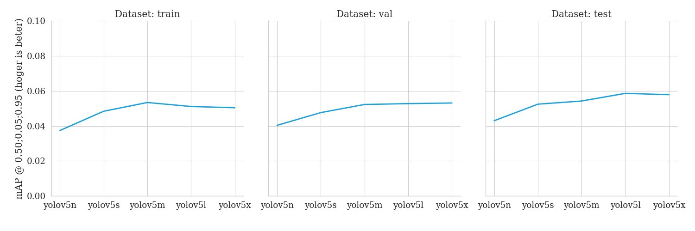
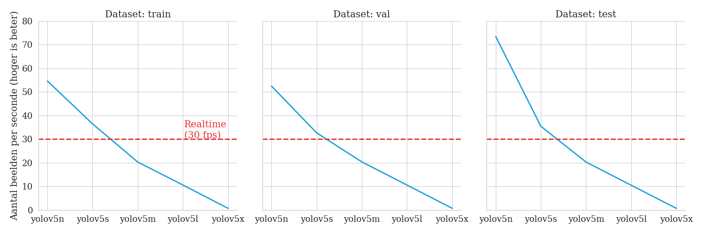
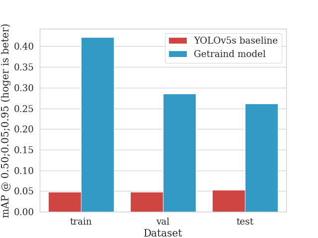
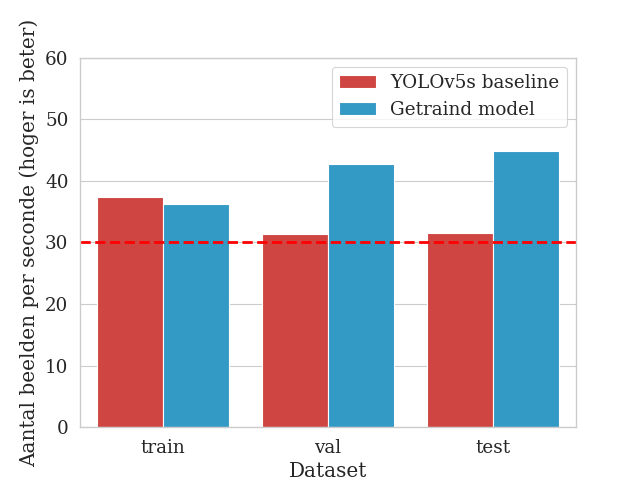

# Implementing YOLOv5 on the RailSem19 dataset

This repository implements multiple YOLOv5 models on the RailSem19 dataset. These implementations are focussed on the `person` and `person-group` classes.

## Installation

- The code is tested on [Python 3.9.9](https://www.python.org/downloads/) and [PyTorch 1.10](https://pytorch.org/get-started/locally/) with CUDA 11.3.
- Install [PyTorch](https://pytorch.org/get-started/locally/) by following the instructions on their website.
- Install [YOLOv5](https://github.com/ultralytics/yolov5) by following the instructions in the README.
- Follow [this](https://stackoverflow.com/a/66800443) StackOverflow answer if you are experiencing the following error: `The paging file is too small for this operation to complete.`

**Make sure YOLOv5 is located in the root of the `railsem19_yolov5` folder.**

## Results

### Baselines

The following baselines are achieved on the YOLOv5 models with only the `person` class:




### Trained model

The following results are achieved on a trained YOLOv5 Small model. The model is trained on the `rs19_person_semseg` dataset. This dataset can be generated by running `./generate_subset_semseg.py`.




### Generating results

Experiments can be run with `./generate_results.py`. Plots are generated by running `./results/analyse_baselines.py` or `./results/analyse_results.py`.

The following are the column headers for the generated .CSV files:
| Model | Dataset | Precision | Recall | mAP@0.50 | mAP@0.50;0.05;0.95 | Pre-process time | Inference time | NMS time per image |
|-|-|-|-|-|-|-|-|-|

## Training

The following command starts the training of your model:

```bash
python ../yolov5/train.py --batch-size -1 --epochs 100 --data ./data/rs19_person.yaml --weights yolov5s.pt --single-cls --workers 1
```

Use the following if you want do run hyperparameter optimalisation:

```bash
python ../yolov5/train.py --batch-size 4 --epochs 10 --data ./data/rs19_person.yaml --weights yolov5s.pt --single-cls --workers 1 --evolve 40
```

## Inference

The following command runs inference on the provided data:

```bash
python ../yolov5/detect.py --source "path/to/file.mp4" --weights "./models/yolov5s.pt" --classes 0
```

The following command was used to check whether images without the class `person` really did not contain any persons:

```bash
python ./yolov5/detect.py --source "./data/rs19_no_human" --weights "./models/trained_best.pt" --classes 0 --iou-thres 0.6 --max-det 100 --conf-thres 0.6 --save-txt --save-conf
```

## Validation

Validation can be done in two ways

### 1. From the command line

```bash
python ../yolov5/val.py --data "./data/rs19_person.yaml" --weights "yolov5s.pt" --batch-size 1 --task val --single-cls
```

### 2. Saving validation results

Running `./generate_results.py` will do the same as above but saves the results to a .CSV file. This script will run the validation on the combination of train/val/test datasets and provided models.
